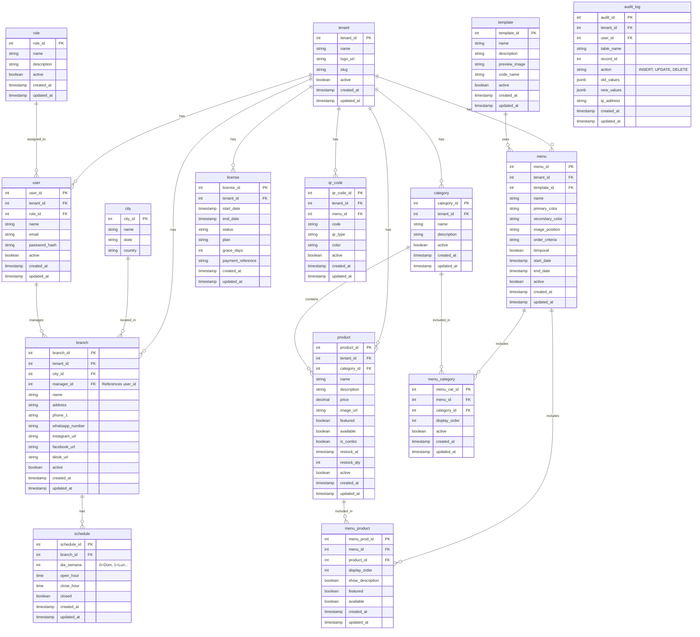

# Modelo Entidad-Relación (MER)

A medida que el proyecto ha evolucionado durante los Sprints 1, 2 y 3, la base de datos se ha robustecido con nuevos campos (redes sociales, control de inventario) y nuevas tablas (auditoría, estructura relacional de menús y horarios).

> [!NOTE]
> En lugar de mantener un archivo XML estático de Draw.io que es difícil de versionar en Git y propenso a corromperse, hemos migrado el diagrama a **Mermaid**. Este formato se renderiza automáticamente de forma visual en GitHub, GitLab, VSCode y herramientas como Docusaurus.

## Diagrama Completo y Actualizado

A continuación se presenta la estructura exacta que tiene la base de datos PostgreSQL actualmente en el contenedor Docker.

## Correcciones Aplicadas vs tu XML de Draw.io

1. **Tabla `user`**: Eliminamos `logo_url` y `cellphone` (no estaban en nuestra migración). Agregamos correctamente `password_hash`, `email` y `active`.
2. **Tabla `branch`**: Se añadieron los campos sociales solicitados (`tiktok_url`, `instagram_url`, `whatsapp_number`, etc) y el `manager_id` para vincular qué usuario administra la sucursal.
3. **Tabla `product`**: Se añadieron los campos para la lógica del auto-restock (`available`, `restock_at`, `restock_qty`) y combos (`is_combo`).
4. **Tabla `audit_log`**: Añadida para mantener la trazabilidad de quién y cuándo mutó los registros (Sprint 2).
5. **Tablas de Menús (`menu`, `template`, `menu_category`, `menu_product`, `schedule`)**: Añadidas para soportar el constructor de menús avanzado del Sprint 3.
6. **Tabla `qr_codes`**: La mantuvimos ya que será la estrella del Sprint 4.
