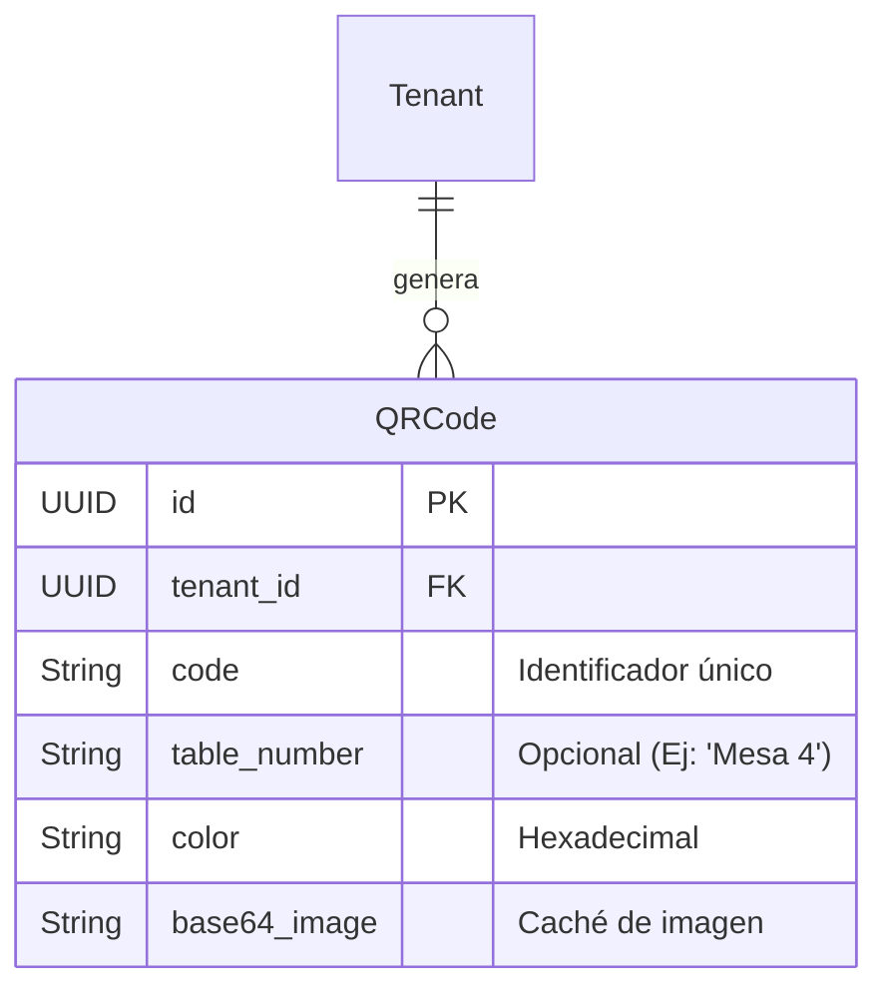
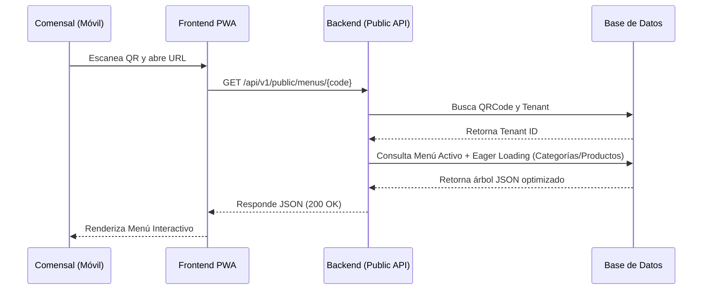

# Sistema de Generación de Códigos QR

El sistema de Códigos QR de DonPunto permite a los restaurantes generar identificadores visuales únicos para que los comensales accedan al menú digital desde sus dispositivos móviles, de forma rápida y sin necesidad de descargar aplicaciones nativas.

## Arquitectura del Modelo Híbrido

Para cumplir con la flexibilidad del mercado gastronómico, el modelo de datos de códigos QR (`QRCode`) está diseñado bajo una arquitectura híbrida:

1. **QR Global por Restaurante**: Genera un único código para todo el establecimiento. Ideal para restaurantes de comida rápida o barras.
2. **QR Específico por Mesa**: Genera códigos individuales vinculados a una mesa específica (`table_number`). Ideal para restaurantes a la carta y pedidos a la mesa.

## Flujo de Interacción del Comensal

Cuando el comensal escanea el código QR, este redirige a la URL pública del Frontend (ej. `app.donpunto.com/m/{code}`). El frontend inmediatamente consulta nuestra API pública para obtener el menú completo.

## Ventajas Técnicas
* **Eager Loading**: El controlador público consolida todas las consultas en un solo JSON estructurado, reduciendo las peticiones HTTP (N+1 query problem).
* **Base64 Native**: Las imágenes QR se envían como strings en Base64, evitando costos de almacenamiento de imágenes estáticas en S3 para algo tan volátil.
